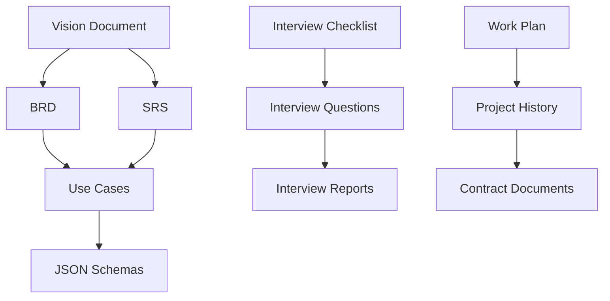

# AI GOST Project Documentation

**Проект**: Создание локальной системы ИИ для автоматизированной обработки документов  
**Заказчик**: ООО «ТДК-АЙТИ»  
**Договор**: №24/25 от 30.09.2025  
**Статус**: Этап анализа и разработки технического задания (30 дней)

---

## 🎯 Быстрая навигация для новых аналитиков

### 📋 Начните здесь (5 минут)
1. **[Vision Document](requirements/vision.md)** - общее понимание проекта
2. **[Project History](project-management/history.md)** - текущее состояние
3. **[Work Plan](project-management/work-plan.md)** - план работы БА

### 🔍 Детальная работа (15 минут)
4. **[Business Requirements](requirements/brd.md)** - приоритизированные требования
5. **[Technical Requirements](requirements/srs.md)** - технические спецификации
6. **[Interview Checklist](interviews/checklist.md)** - подготовка к интервью
7. **[Use Cases](requirements/use-cases.md)** - сценарии использования
8. **[Prototypes](prototypes/README.md)** - планы реализации прототипов

---

## 📁 Структура документации

### `/docs/requirements/` - Стек требований
| Файл | Описание | Статус |
|------|----------|--------|
| `vision.md` | Общее видение и цели проекта | ✅ Готов |
| `brd.md` | Бизнес-требования по приоритетам | ✅ Готов |
| `srs.md` | Технические требования | ✅ Готов |
| `use-cases.md` | Сценарии использования | ✅ Готов |
| `schemas/` | JSON-схемы и примеры данных | ✅ Готов |

### `/docs/interviews/` - Подготовка к интервью
| Файл | Описание | Статус |
|------|----------|--------|
| `checklist.md` | Консолидированный чек-лист подготовки | 🔄 Объединен |
| `questions.md` | Приоритизированные вопросы | 🔄 Объединен |
| `templates/` | Шаблоны отчетов и протоколов | ✅ Готов |

### `/docs/project-management/` - Управление проектом
| Файл | Описание | Статус |
|------|----------|--------|
| `work-plan.md` | Детальный план работы БА (40 часов) | ✅ Готов |
| `history.md` | История проекта и текущее состояние | ✅ Готов |
| `contracts/` | Договорная документация | ✅ Готов |

### `/docs/prototypes/` - Прототипы системы
| Файл | Описание | Статус |
|------|----------|--------|
| `README.md` | Обзор всех прототипов | ✅ Готов |
| `prototype-1-ocr.md` | Извлечение данных (OCR) | ✅ Готов |
| `prototype-2-structuring.md` | Структурирование данных | ✅ Готов |
| `prototype-3-classification.md` | Тематическая классификация | ✅ Готов |

### `/assets/` - Медиафайлы
| Папка | Содержимое | Статус |
|-------|------------|--------|
| `audio/` | Аудиозаписи встреч (.m4a) | ✅ Готов |
| `images/` | Изображения и схемы (.jpg) | ✅ Готов |

### `/archive/` - Устаревшие материалы
| Папка | Содержимое | Статус |
|-------|------------|--------|
| `deprecated/` | Неактуальные версии документов | 🔄 Создается |

---

## 🎯 Ключевые особенности проекта

### Критические ограничения
- **Локальное развертывание** без доступа к интернету (air-gapped environment)
- **Ролевая модель доступа** с разграничением по типам информации
- **Продуктовая перспектива** - создание решения для рынка

### Целевые форматы документов
- **PDF и изображения** - основной поток документооборота
- **DWG-чертежи** - инженерная документация
- **Сметы ARP/GSFX** - финансовая документация
- **Текстовые документы** - структурирование и классификация

### Прототипы (согласно Приложению 3)
1. **Извлечение данных** - OCR для PDF, изображений, DWG, смет
2. **Структурирование** - группировка и организация данных
3. **Тематическая классификация** - NLP для категоризации документов

---

## ⚠️ Критические зависимости

### Немедленные действия
- [ ] Создать Telegram-группу для коммуникации
- [ ] Провести техническое интервью с заказчиком
- [ ] Получить образцы данных для прототипов
- [ ] Начать исследование AI-технологий

### Риски проекта
1. **Недоступность стейкхолдеров** для интервью
2. **Отсутствие качественных образцов данных**
3. **Технические ограничения** локального развертывания
4. **Расширение объема работ** в процессе выполнения

---

## 📊 Метрики проекта

| Параметр | Значение |
|----------|----------|
| **Бюджет** | 615 000 рублей (50%/50%) |
| **Срок** | 30 календарных дней |
| **Команда** | 4 специалиста (132 часа) |
| **Прототипы** | 3 (согласно Приложению 3) |
| **Статус** | Подготовка к интервью |

---

## 🔗 Связи между документами

---

## 📝 Контакты и коммуникация

### Основные контакты
- **Денис** - технические вопросы, процессы
- **Елена** - бизнес-вопросы, стратегия

### Формат работы
- **Telegram-чат** + регулярные встречи
- **Доступность**: после 18:00 по Москве
- **Частота**: ежедневные статусы, еженедельные отчеты

---

## 🚀 Следующие шаги

1. **Изучить Vision Document** для понимания целей
2. **Ознакомиться с Work Plan** для понимания задач
3. **Подготовиться к интервью** используя Checklist
4. **Получить образцы данных** от заказчика
5. **Начать исследование технологий** для прототипов

---

**Последнее обновление**: 01.10.2025  
**Ответственный**: Бизнес-аналитик проекта AI GOST  
**Следующее обновление**: После проведения интервью с заказчиком
