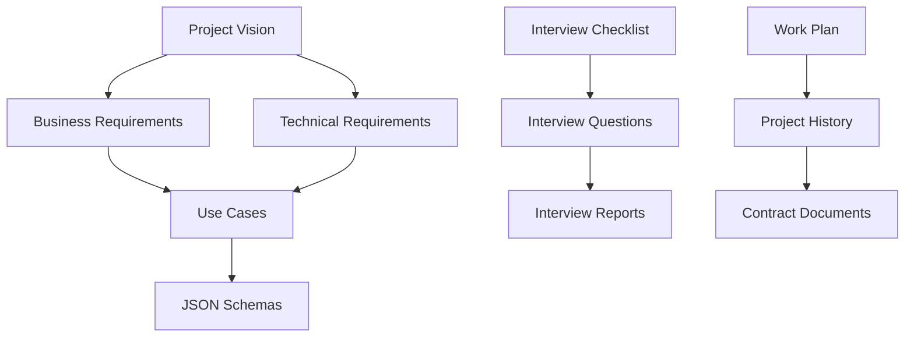

# AI GOST Project Documentation

**Project**: Local AI system for automated document processing  
**Customer**: LLC "TDK-IT"  
**Contract**: #24/25 dated 30.09.2025  
**Status**: Analysis and technical specification development stage (30 days)

---

## Quick Navigation for New Analysts

### Start Here (5 minutes)
1. **[Project Vision](01-project-overview/project-vision.md)** - project understanding
2. **[Project History](01-project-overview/project-history.md)** - current state
3. **[Work Plan](04-project-management/work-plan.md)** - BA work plan

### Detailed Work (15 minutes)
4. **[Business Requirements](02-requirements/business-requirements.md)** - prioritized requirements
5. **[Technical Requirements](02-requirements/technical-requirements.md)** - technical specifications
6. **[Metrics](02-requirements/metrics.md)** - target metrics and thresholds
7. **[Interview Checklist](05-interviews/checklist.md)** - interview preparation
8. **[Use Cases](02-requirements/use-cases.md)** - usage scenarios
9. **[Prototypes](03-prototypes/README.md)** - implementation plans

---

## Documentation Structure

### `01-project-overview/` - Project Overview
| File | Description | Status |
|------|-------------|--------|
| `README.md` | Main project documentation and navigation | Draft |
| `project-vision.md` | Project vision and goals | Draft |
| `project-history.md` | Project history and current state | Draft |

### `02-requirements/` - Requirements Stack
| File | Description | Status |
|------|-------------|--------|
| `business-requirements.md` | Business requirements by priorities | Draft |
| `technical-requirements.md` | Technical requirements | Draft |
| `use-cases.md` | Usage scenarios | Draft |
| `document-classification.md` | Document classification requirements | Draft |
| `metrics.md` | Success metrics and thresholds | Draft |
| `schemas/` | JSON schemas and data examples | Draft |

### `03-prototypes/` - System Prototypes
| File | Description | Status |
|------|-------------|--------|
| `README.md` | All prototypes overview | Draft |
| `prototype-1-ocr.md` | Data extraction (OCR) | Draft |
| `prototype-2-structuring.md` | Data structuring | Draft |
| `prototype-3-classification.md` | Thematic classification | Draft |

### `04-project-management/` - Project Management
| File | Description | Status |
|------|-------------|--------|
| `work-plan.md` | Detailed BA work plan (40 hours) | Draft |
| `customer-report.md` | Customer communication reports | Draft |
| `contracts/` | Contract documentation | Draft |

### `05-interviews/` - Interview Materials
| File | Description | Status |
|------|-------------|--------|
| `README.md` | Interview materials overview | Draft |
| `checklist.md` | Consolidated preparation checklist | Draft |
| `questions.md` | Prioritized questions | Draft |
| `templates/` | Report templates and protocols | Draft |
| `build/` | Generated interview materials | Draft |
| Various reports | Interview reports and analysis | Draft |

### `06-assets/` - Media Files
| Folder | Content | Status |
|--------|---------|--------|
| `audio/` | Meeting recordings (.m4a) | Draft |
| `images/` | Images and diagrams (.jpg) | Draft |
| `input-documents/` | Sample documents for analysis | Draft |

### `07-archive/` - Deprecated Materials
| Folder | Content | Status |
|--------|---------|--------|
| `deprecated/` | Outdated document versions | Archive |
| `migration-log.md` | Migration history | Archive |
| `structure-restructure-prompt.txt` | Restructuring instructions | Archive |

---

## Key Project Features

### Critical Constraints
- **Local deployment** without internet access (air-gapped environment)
- **Role-based access** with information type restrictions
- **Product perspective** - creating solution for market

### Target Document Formats
- **PDF and images** - main document flow
- **DWG drawings** - engineering documentation
- **ARP/GSFX estimates** - financial documentation
- **Text documents** - structuring and classification

### Prototypes (per Appendix 3)
1. **Data extraction** - OCR for PDF, images, DWG, estimates
2. **Structuring** - data grouping and organization
3. **Thematic classification** - NLP for document categorization

---

## Critical Dependencies

### Immediate Actions
- [ ] Create Telegram group for communication
- [ ] Conduct technical interview with customer
- [ ] Obtain data samples for prototypes
- [ ] Start AI technology research

### Project Risks
1. **Stakeholder unavailability** for interviews
2. **Lack of quality data samples**
3. **Technical constraints** of local deployment
4. **Scope expansion** during execution

---

## Project Metrics

| Parameter | Value |
|-----------|-------|
| **Budget** | 615,000 rubles (50%/50%) |
| **Timeline** | 30 calendar days |
| **Team** | 4 specialists (132 hours) |
| **Prototypes** | 3 (per Appendix 3) |
| **Status** | Interview preparation |

---

## Document Relationships

---

## Contacts and Communication

### Main Contacts
- **Denis** - technical questions, processes
- **Elena** - business questions, strategy

### Work Format
- **Telegram chat** + regular meetings
- **Availability**: after 18:00 Moscow time
- **Frequency**: daily status updates, weekly reports

---

## Next Steps

1. **Study Project Vision** for goal understanding
2. **Review Work Plan** for task understanding
3. **Prepare for interviews** using Checklist
4. **Obtain data samples** from customer
5. **Start technology research** for prototypes

---

**Last Update**: 01.10.2025  
**Responsible**: AI GOST Project Business Analyst  
**Next Update**: After customer interview